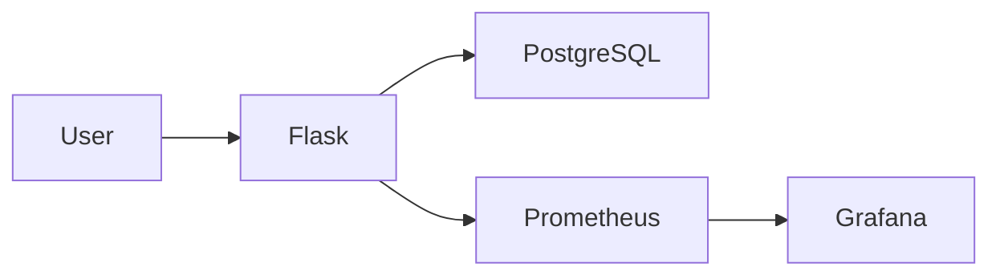

# Cloud Homelab Dashboard

A containerised Flask application for managing and monitoring a small homelab environment.

The project is designed as a practical DevOps portfolio project, demonstrating containerisation, automated testing, CI/CD, image versioning, monitoring, alerting, and deployment with rollback capability.

## Application

The application provides an API for managing homelab servers, including server creation, updates, retrieval and status management.

## Architecture

The application is split into three layers:

### Routes

Responsible for handling HTTP requests and responses.

### Services

Responsible for business logic and validation.

### Repositories

Responsible for database communication.

## Infrastructure

The application runs as a Docker Compose stack consisting of a Flask application, PostgreSQL database, Prometheus and Grafana.

## Technologies
Python/Flask
PostgreSQL
Docker/Docker Compose
GitHub Actions
GitHub Container Registry
Prometheus
Grafana
Pytest
Bash/Linux

## Local Development

the application can be run locally using Docker Compose.

Start the application and supporting services with:
    docker compose up -d
the application is available at:
    http://localhost:5000
Prometheus is available at:
    http://localhost:9090
Grafana is available at:
    http://localhost:3000

the development Compose configuration builds the application image locally, while the deployment configuration pulls a specific image version from GHCR

## Deployment

The application is deployed using a Docker image published to GitHub Container Registry.

A specific image version can be deployed using:

IMAGE_TAG=<version> docker compose -f docker-compose.deploy.yml up -d

The repository also includes a deployment script which performs health checks, verifies the running image, checks Prometheus monitoring, and can automatically roll back to the previous image if deployment verification fails.

To deploy using the script:

./deploy.sh <image-tag>

## CI/CD

GitHub Actions automatically tests, builds and publishes the application

The pipeline:
    Runs unit tests.
    Builds the Docker image.
    Runs integration tests against the containerised application.
    Publishes the image to GitHub Container Registry.
    Tags each image with:
        latest
        GitHub Actions run number
        Git commit SHA

The commit SHA tag allows a specific version of the application to be deployed and provides a traceable link between a deployment and the source code that produced it.

## Moinitoring and Observability

the appliction exposes Prometheus metrics which are collected by Prometheus and visualised with Grafana.

The monitoring stack tracks:
    application health
    applicatio memory usage
    application CPU usage
    HTTP request rate 
    HTTP 4xx and 5xx error rates 
    HTTP request latency

Grafana is configured to alert for application downtime, high CPU usage and elevated HTTP error rates. Alerts are delivered by email

Application metrics are instrumented directly in the Flask appliction using the Prometheus Python client

## Testing 

the project includes unit and integration tests covering the application and database layers.

The CI pipeline runs:
    Unit tests for the service and repository layers 
    Integration tests against the containerised application
    A health check to verify that the deployed container is responding beofre integration tests are executed

tests are run automatically on Github action before Docker images are published to GHCR
